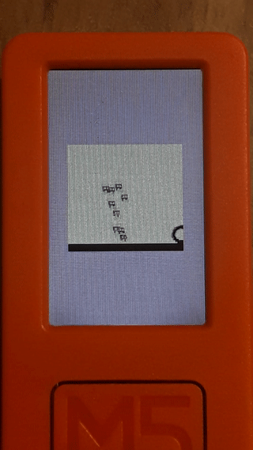

# crisp-game-lib-portable

Minimal C-lang library for creating classic arcade-like mini-games running on devices and browsers (Experimental).

To make the [crisp-game-lib](https://github.com/abagames/crisp-game-lib) work on small devices, the library is implemented in C.

The goal now is to get it running on the [M5StickC PLUS](https://shop.m5stack.com/products/m5stickc-plus-esp32-pico-mini-iot-development-kit).

[Emscripten](https://emscripten.org/) also makes it possible to run [games written in C](https://github.com/abagames/crisp-game-lib-portable/blob/main/src/c/game.c) on the browser. ([DEMO](https://abagames.github.io/crisp-game-lib-portable/build/))

## Build for M5StickC PLUS

Compile [m5stickcplus.ino](https://github.com/abagames/crisp-game-lib-portable/blob/main/src/c/m5stickcplus.ino) with [Arduino IDE 1.8](https://www.arduino.cc/en/software) or [vscode-arduino](https://github.com/microsoft/vscode-arduino)

## Build for browsers

1. Run `dev` npm script to start the dev server and watch [js files](https://github.com/abagames/crisp-game-lib-portable/tree/main/src/js)

1. Run `dev_c` npm script to watch [c files](https://github.com/abagames/crisp-game-lib-portable/tree/main/src/c) and build [wasm files](https://github.com/abagames/crisp-game-lib-portable/tree/main/public/wasm)

## Unimplemented features

- ~~Procedurally generated musics and [sound effects](https://abagames.github.io/crisp-game-lib/ref_document/functions/play.html)~~
- [Difficulty](https://abagames.github.io/crisp-game-lib/ref_document/variables/difficulty.html)
- [Score](https://abagames.github.io/crisp-game-lib/ref_document/functions/addScore.html)
- [Game over](https://abagames.github.io/crisp-game-lib/ref_document/functions/end.html), title screen and replay
- [Particle](https://abagames.github.io/crisp-game-lib/ref_document/functions/particle.html)
- [Color](https://abagames.github.io/crisp-game-lib/ref_document/functions/color.html)
- [Bar](https://abagames.github.io/crisp-game-lib/ref_document/functions/bar.html) and [box](https://abagames.github.io/crisp-game-lib/ref_document/functions/box.html)
- [Letter options](https://abagames.github.io/crisp-game-lib/ref_document/types/LetterOptions.html)
- [Game options](https://abagames.github.io/crisp-game-lib/ref_document/types/Options.html)
- Precise collision detection for texts and characters
- Utility functions
- [Input position](https://abagames.github.io/crisp-game-lib/ref_document/variables/input.pos.html)

## Known issues

- Texts and characters are drawn without transparency (Is there any way to draw an image to TFT_eSprite with the transparent color?)
